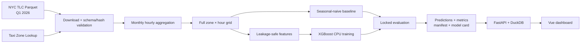
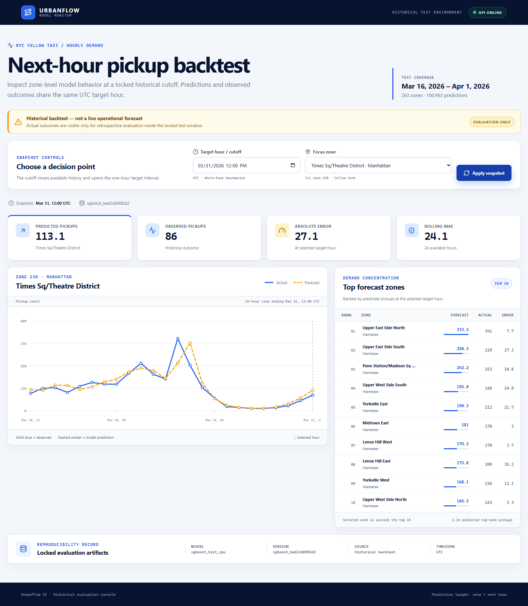

<div align="center">
  <h1>UrbanFlow AI</h1>
  <p><strong>Dự báo lượt đón Yellow Taxi theo taxi zone cho giờ kế tiếp tại New York City</strong></p>
  <p>Reproducible ML pipeline · Historical backtest · FastAPI · Vue dashboard</p>

  <p>
    
    
    <a href="https://www.python.org/"></a>
    <a href="https://fastapi.tiangolo.com/"></a>
    <a href="https://vuejs.org/"></a>
    <a href="https://duckdb.org/"></a>
    <a href="https://xgboost.ai/"></a>
    <a href="#verification"></a>
    <a href="#scope"></a>
  </p>

  <p>
    <a href="#overview">Tổng quan</a> ·
    <a href="#architecture">Kiến trúc</a> ·
    <a href="#results">Kết quả</a> ·
    <a href="#quick-start">Quick start</a> ·
    <a href="#api">API</a> ·
    <a href="#reproducibility">Tái lập</a>
  </p>
</div>

---

> [!IMPORTANT]
> UrbanFlow AI là **historical backtest trên dữ liệu Q1/2026**, không phải hệ thống dự báo live hoặc production. API và dashboard chỉ phục vụ các prediction đã khóa trong test window.

<a id="overview"></a>
## Tổng quan

UrbanFlow AI xây dựng một pipeline end-to-end để dự báo số lượt đón Yellow Taxi được ghi nhận cho từng taxi zone trong giờ kế tiếp.

| Thành phần | Contract |
| --- | --- |
| Đơn vị dự báo | `zone_id × target_hour_utc` |
| Target | `trip_count` trong giờ `[target_hour_utc, target_hour_utc + 1h)` |
| Thông tin đầu vào | Chỉ dữ liệu khả dụng trước `target_hour_utc` |
| Nguồn dữ liệu | NYC TLC Yellow Taxi Parquet và Taxi Zone Lookup |
| Múi giờ nội bộ | UTC; dữ liệu nguồn được xử lý DST trước khi đổi từ `America/New_York` |
| Đánh giá | Time split cố định; chọn model bằng validation, test chỉ dùng một lần sau khi khóa cấu hình |
| Serving | FastAPI đọc prediction artifact bằng DuckDB; không load hoặc train XGBoost khi nhận request |

### Điểm nổi bật

- ETL theo tháng, chọn đúng cột cần thiết và giới hạn DuckDB ở 2 threads / 1 GB.
- Full hourly grid phân biệt giờ có `0` chuyến với giờ nguồn bị thiếu hoặc mơ hồ do DST.
- Feature leakage-safe gồm calendar UTC, lag 1/24/168 giờ và rolling mean 24/168 giờ; mọi rolling đều kết thúc tại `target_hour_utc - 1h`.
- Seasonal-naive 168 giờ làm baseline bắt buộc trước khi đánh giá XGBoost.
- Artifact có schema, row count, SHA-256, provenance, resource measurements và model card.
- FastAPI + Vue dashboard phục vụ snapshot, ranking, lịch sử forecast/actual và disclosure historical backtest.
- Reliability gate kiểm tra exact dependency pins, report chain, hash/size, artifact footprint và serving store.

<a id="architecture"></a>
## Kiến trúc



### Luồng dữ liệu

1. Downloader xác minh URL, schema, row count, kích thước và SHA-256 của từng file nguồn.
2. ETL aggregate pickup theo zone và giờ local, xử lý DST, sau đó chuẩn hóa sang UTC.
3. Full grid giữ riêng `available`, `source_missing` và `dst_ambiguous`; chỉ giờ có nguồn hợp lệ mới được điền zero.
4. Feature builder tạo lag/rolling trên full grid và giữ target tách khỏi feature.
5. Model selection dùng validation MAE; WAPE và tên candidate chỉ dùng để phá hòa.
6. Test predictions được khóa, phân tích lỗi và phục vụ trực tiếp qua API.

## Dashboard

<p align="center">
  
</p>

Dashboard hỗ trợ:

- chọn cutoff UTC nằm trong test window;
- xem forecast và actual theo taxi zone;
- xếp hạng top zones theo prediction;
- biểu đồ 24 giờ forecast/actual và MAE cửa sổ;
- hiển thị model version, test window và cảnh báo historical backtest trên mọi snapshot.

<a id="results"></a>
## Kết quả đã xác minh

### Model đã khóa

| Artifact | Validation MAE | Validation WAPE | Test MAE | Test WAPE |
| --- | ---: | ---: | ---: | ---: |
| Seasonal naive 168h | 6.397990 | 0.308649 | 4.675301 | 0.237388 |
| XGBoost `xgboost_bd51e85845a0` | **4.204104** | **0.202812** | **3.755908** | **0.190706** |

XGBoost giảm test MAE và WAPE **19.6649%** so với seasonal-naive trên cùng 100,992 hàng test. Candidate `depth6` được chọn bằng validation, sau đó fit lại trên train + validation với seed 42, 2 threads và 431 boost rounds.

### Reliability và serving

| Chỉ số | Giá trị đo được |
| --- | ---: |
| Test prediction rows | 100,992 |
| Taxi zones | 263 |
| Test target hours | 384 |
| Model train time | 55.088 giây |
| Model process RSS peak | 349,003,776 bytes |
| PredictionStore startup | 140.427 ms |
| Forecast median, 10 runs | 2.756 ms |
| History 24h median, 10 runs | 4.696 ms |
| Rankings median, 10 runs | 3.199 ms |
| Report references verified | 38 |
| Artifact footprint | 44 files · 208,863,175 bytes |
| Automated tests | 36 passed |

Các benchmark query gọi trực tiếp `PredictionStore`, không bao gồm HTTP hoặc browser overhead. Median đều dưới 10 ms nên pipeline không thêm cache phục vụ chưa cần thiết.

<a id="quick-start"></a>
## Quick start

### Yêu cầu

- Windows PowerShell;
- Python `>=3.11,<3.12`;
- Node.js 22+ và npm cho dashboard;
- khoảng trống đĩa phù hợp cho raw/processed artifacts; các file này không được commit.

### 1. Tạo Python environment

Từ repository root:

```powershell
py -3.11 -m venv .venv
.\.venv\Scripts\Activate.ps1
python -m pip install --upgrade pip
python -m pip install -e ".[dev]"
```

### 2. Chạy pipeline đầy đủ

```powershell
powershell -ExecutionPolicy Bypass -File .\scripts\run_pipeline.ps1
```

Runner kiểm tra exact dependency pins/imports và `pip check`, sau đó chạy tuần tự:

```text
download/verify → EDA → aggregate → grid → baseline → features → train → analysis
```

Nếu memory guard dừng stage train, giải phóng RAM rồi tiếp tục đúng stage lỗi:

```powershell
powershell -ExecutionPolicy Bypass -File .\scripts\run_pipeline.ps1 -StartStage 6
```

### 3. Cài dashboard dependencies

```powershell
cd web
npm install
cd ..
```

### 4. Chạy demo

```powershell
powershell -ExecutionPolicy Bypass -File .\scripts\start_demo.ps1
```

Launcher chạy FastAPI tại `http://127.0.0.1:8000`, Vite tại `http://127.0.0.1:5173`, đợi cả hai health check rồi mở browser. `Ctrl+C` dừng cả hai process tree.

Các chế độ kiểm tra không cần thao tác thủ công:

```powershell
# Kiểm tra Python, npm, artifacts, checksum, schema và ports; không mở service
powershell -ExecutionPolicy Bypass -File .\scripts\start_demo.ps1 -CheckOnly

# Khởi động API/UI, kiểm tra HTTP trực tiếp và qua Vite proxy, rồi tự cleanup
powershell -ExecutionPolicy Bypass -File .\scripts\start_demo.ps1 -SmokeTest

# Chạy service nhưng không tự mở browser
powershell -ExecutionPolicy Bypass -File .\scripts\start_demo.ps1 -NoBrowser
```

<a id="reproducibility"></a>
## Pipeline và tái lập

### Reliability runner

```powershell
# Chỉ kiểm tra environment, report chain, artifact sizes/hashes và API store
powershell -ExecutionPolicy Bypass -File .\scripts\run_pipeline.ps1 -VerifyOnly

# Tiếp tục từ một stage cụ thể, index 0..7
powershell -ExecutionPolicy Bypass -File .\scripts\run_pipeline.ps1 -StartStage 6
```

| Stage | Index | Module | Config |
| --- | ---: | --- | --- |
| Download hoặc xác minh raw files | 0 | `urbanflow.download_data` | `configs/data_sources.json` |
| Kiểm tra chất lượng tháng cấu hình | 1 | `urbanflow.inspect_data` | `configs/eda.json` |
| Aggregate hourly pickups | 2 | `urbanflow.aggregate_hourly` | `configs/aggregate.json` |
| Dựng full hourly grid | 3 | `urbanflow.build_hourly_grid` | `configs/grid.json` |
| Đánh giá seasonal baseline | 4 | `urbanflow.evaluate_baseline` | `configs/baseline.json` |
| Tạo leakage-safe features | 5 | `urbanflow.build_features` | `configs/features.json` |
| Train model CPU | 6 | `urbanflow.train_model` | `configs/model.json` |
| Phân tích locked test errors | 7 | `urbanflow.analyze_model` | `configs/model_analysis.json` |

Mỗi stage ghi log vào `artifacts/reliability/logs/`. Run report và báo cáo tổng hợp nằm tại:

- `artifacts/reliability/pipeline-run.json`;
- `artifacts/reliability/w5-t1-report.json`.

<details>
<summary><strong>Chạy từng module thủ công</strong></summary>

```powershell
python -m urbanflow.download_data --config configs/data_sources.json
python -m urbanflow.inspect_data --config configs/eda.json
python -m urbanflow.aggregate_hourly --config configs/aggregate.json
python -m urbanflow.build_hourly_grid --config configs/grid.json
python -m urbanflow.evaluate_baseline --config configs/baseline.json
python -m urbanflow.build_features --config configs/features.json
python -m urbanflow.train_model --config configs/model.json
python -m urbanflow.analyze_model --config configs/model_analysis.json
```

Model config có memory guard: RAM khả dụng tối thiểu 256 MiB, process RSS tối đa 1 GiB và `threads = 2`.

Nếu laptop không giữ được memory guard khi các ứng dụng khác đang mở, tạo bundle Colab CPU:

```powershell
python -m urbanflow.prepare_colab --config configs/model.json
```

Upload `artifacts/colab/urbanflow-colab-input.zip` vào `notebooks/train_model_colab.ipynb`. Notebook xác minh checksum, tạo Python 3.11 environment và chạy test trước khi train.

</details>

## Dữ liệu và đánh giá

### Nguồn

- [NYC TLC Trip Record Data](https://www.nyc.gov/site/tlc/about/tlc-trip-record-data.page)
- [Yellow Taxi Data Dictionary](https://www.nyc.gov/assets/tlc/downloads/pdf/data_dictionary_trip_records_yellow.pdf)
- NYC TLC Taxi Zone Lookup

V1 chỉ dùng `tpep_pickup_datetime` và `PULocationID` từ Yellow Taxi Parquet. Weather, event, traffic và live feed nằm ngoài phạm vi hiện tại.

### Time split đã khóa

| Split | UTC interval | Mục đích |
| --- | --- | --- |
| Train | `[2026-01-01T05:00:00Z, 2026-03-01T05:00:00Z)` | Fit candidate models |
| Validation | `[2026-03-01T05:00:00Z, 2026-03-16T04:00:00Z)` | Chọn candidate và boost rounds |
| Test | `[2026-03-16T04:00:00Z, 2026-04-01T04:00:00Z)` | Locked final evaluation |

Không random split. Test không được dùng để đổi feature, candidate parameters hoặc boost rounds.

### Leakage safeguards

- Target của hàng `target_hour_utc = h` là pickup count trong chính giờ `h`.
- Lag dùng đúng `h - 1h`, `h - 24h`, `h - 168h` theo cùng zone.
- Rolling 24/168 giờ chỉ dùng các hàng đến `h - 1h` và giữ `NULL` nếu lịch sử chưa đủ.
- Calendar feature lấy từ UTC `target_hour_utc`; không dùng trạng thái nguồn hoặc actual của giờ đích.
- Mọi transformation được chạy trên full grid trước khi lọc các hàng đủ feature.

<a id="api"></a>
## API

Chạy riêng FastAPI:

```powershell
python -m uvicorn urbanflow.api:app --host 127.0.0.1 --port 8000
```

OpenAPI UI: `http://127.0.0.1:8000/docs`

| Endpoint | Chức năng |
| --- | --- |
| `GET /health` | Model/version, test window, prediction rows và zone count |
| `GET /zones` | Danh sách 263 zones được phục vụ |
| `GET /forecast` | Forecast và actual cho một zone tại cutoff UTC |
| `GET /rankings` | Top zones theo prediction tại cutoff |
| `GET /history` | Chuỗi forecast/actual và MAE của một cửa sổ thời gian |

Ví dụ:

```http
GET /forecast?cutoff_utc=2026-03-16T04:00:00Z&zone_id=161
```

```json
{
  "source": "historical_backtest",
  "cutoff_utc": "2026-03-16T04:00:00Z",
  "target_hour_utc": "2026-03-16T04:00:00Z",
  "zone_id": 161,
  "borough": "Manhattan",
  "zone_name": "Midtown Center",
  "service_zone": "Yellow Zone",
  "prediction": 23.633546829223633,
  "actual_trip_count": 18,
  "absolute_error": 5.633546829223633,
  "model_name": "xgboost_hist_cpu",
  "model_version": "xgboost_bd51e85845a0"
}
```

`cutoff_utc` đồng thời là đầu giờ đích. API chỉ nhận giờ tròn UTC trong test window, trả `404` cho zone không được phục vụ và `422` cho input sai schema.

<a id="verification"></a>
## Kiểm thử và quality gates

```powershell
# Python tests
python -m pytest -q

# Frontend typecheck + production build
cd web
npm run build
```

Test suite bao phủ:

- ETL schema, monthly boundaries và zone mapping;
- full-grid zero/source-missing/DST semantics;
- future-leak và rolling-window contracts;
- model target isolation và memory guard;
- artifact hash/size tampering và exact dependencies;
- API response schema, valid requests và invalid input paths.

Reliability gate cuối cùng đã xác minh Python 3.11.9, 11 exact dependency pins, 38 report references và serving artifact thật. API smoke trả `200` cho `/health` và forecast hợp lệ, `422` cho `cutoff_utc` không hợp lệ.

## Cấu trúc repository

```text
urbanflow-ai/
├── configs/                  # Data, ETL, feature, model, API, reliability configs
├── docs/
│   ├── screenshots/          # Dashboard evidence
│   ├── DATA_AND_EVALUATION.md
│   ├── PROJECT_SPEC.md
│   ├── TASK_BOARD.md
│   ├── data-card.md
│   └── model-card.md
├── notebooks/                # Colab CPU training workflow
├── scripts/
│   ├── run_pipeline.ps1      # Sequential pipeline + reliability gate
│   └── start_demo.ps1        # FastAPI + Vue launcher
├── src/urbanflow/            # ETL, features, model, analysis, API, reliability
├── tests/                    # Behavioral and contract tests
├── web/                      # Vue 3 + TypeScript + Vite dashboard
├── pyproject.toml
└── README.md
```

Raw data, processed data, model artifacts, caches, virtual environments và secrets nằm ngoài Git. Chỉ các tài liệu, config và sample nhỏ cần thiết cho tái lập được version control.

## Tài liệu

- [Product specification](docs/PROJECT_SPEC.md)
- [Data and evaluation contract](docs/DATA_AND_EVALUATION.md)
- [Data card](docs/data-card.md)
- [Model card](docs/model-card.md)
- [Six-week roadmap](docs/ROADMAP_6_WEEKS.md)
- [Task board and measured execution log](docs/TASK_BOARD.md)
- [AI workflow](docs/AI_WORKFLOW.md)

<a id="scope"></a>
## Phạm vi và giới hạn

- Kết quả chỉ mô tả historical backtest Q1/2026; chưa chứng minh khả năng tổng quát sang mùa hoặc năm khác.
- `trip_count` là số lượt pickup được TLC ghi nhận, không phải toàn bộ nhu cầu đi lại hoặc nhu cầu chưa được phục vụ.
- API phục vụ precomputed test predictions, không thực hiện online inference.
- V1 chưa có weather, event, traffic, map geometry, uncertainty interval hoặc monitoring production.
- Hourly source coverage chỉ phát hiện giờ mất hoàn toàn; không phát hiện mất dữ liệu một phần trong một giờ.
- Query benchmark trực tiếp không bao gồm HTTP, browser rendering hoặc network latency.

---

<p align="center">
  <strong>UrbanFlow AI</strong><br>
  Built for reproducible forecasting, transparent evaluation, and an honest historical demo.
</p>
